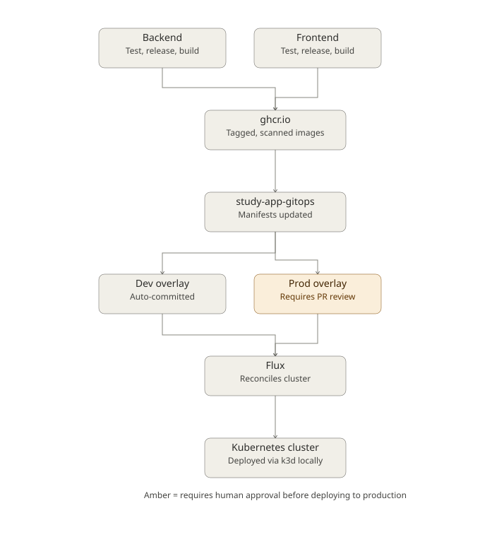

# Study App

A full-stack study-tracking application, built primarily as an infrastructure and DevOps engineering exercise: a small FastAPI/Flask app used as the vehicle to design, build, and operate a complete containerized, GitOps-driven deployment pipeline — from local development environment through CI to Kubernetes.

**This README documents the infrastructure and delivery pipeline.** The application itself (a study-session tracker) is intentionally simple; the engineering depth is in how it's built, tested, secured, released, and deployed.

> **Where deployments actually live:** this repository holds application source code and CI/CD pipeline definitions only. It contains **no deployment manifests**. All Kubernetes manifests, per-environment configuration, and released image tags are managed in a dedicated, separate repository — [`study-app-gitops`](https://github.com/AhsanRahat12/study-app-gitops) — which the pipelines below keep automatically in sync. That repo is the single source of truth for "what version is running where."

---

## Architecture Overview



Backend and frontend are treated as **fully independent services** throughout the entire pipeline — separate versioning, separate images, separate release cadence, separate promotion to production. A frontend-only change never triggers a backend rebuild, redeploy, or version bump, and vice versa.

---

## Infrastructure & Environment Setup

- **Reproducible dev environment**: a devcontainer with Docker-in-Docker, so the entire toolchain (Docker, `k3d`, `kubectl`, `flux`, `gh`, `uv`, `ruff`) is version-pinned and identical for any contributor, with zero "works on my machine" drift.
- **`mise`** manages all tool versions and exposes the project's operational commands as discoverable, documented tasks (`mise run <task>`) rather than a README full of commands to copy-paste and remember.
- **Local Kubernetes via `k3d`**: a full, disposable Kubernetes cluster running as Docker containers inside the devcontainer — used both for manual local testing and as the target for the automated end-to-end test suite.

```bash
mise run k8s-setup-local     # spin up a cluster, build images, deploy the app
mise run k8s-setup-minimal   # bare cluster only, nothing deployed
mise run k8s-setup-gitops    # cluster + Flux, syncing from study-app-gitops
mise run e2e-test            # full end-to-end test suite against a real cluster
```

---

## CI/CD Pipeline

The pipeline is intentionally **not one monolithic workflow** — it's a set of small, independently-triggered workflows chained together via GitHub Actions' path filtering and reusable workflows (`workflow_call`), which keeps each pipeline stage readable and independently debuggable rather than one large, opaque file.

| Stage | Workflow | What It Does |
|---|---|---|
| **Path-aware triggering** | `check_paths` job (per component) | Uses `dorny/paths-filter` so a PR only triggers the backend or frontend pipeline for the component that actually changed — critical in a monorepo to avoid wasted CI time and false-positive failures |
| **Lint & format** | Ruff, run with the exact same command/context locally and in CI | Enforces both correctness-oriented lint rules (e.g. flagging blind exception handling, naive datetimes) and consistent formatting |
| **Test & coverage** | Pytest + `pytest-cov` | Unit and integration tests per component, with an enforced minimum coverage threshold as a merge gate |
| **End-to-end testing** | Python test harness (`e2e_test.py`) | Provisions a real k3d cluster, builds and loads the actual Docker images, deploys via Kustomize, and exercises the live HTTP API and frontend — not mocked, a genuine integration test against a running cluster |
| **Release automation** | [release-please](https://github.com/googleapis/release-please) | Parses Conventional Commit history **per component** and automatically proposes semantic version bumps, changelogs, and GitHub releases — independently for backend and frontend |
| **Image build & publish** | `docker/build-push-action`, triggered on release tag | Multi-stage, non-root, Alpine-based Docker builds, pushed to GitHub Container Registry, tagged both with the specific release version and `latest` |
| **Vulnerability scanning** | Trivy | Scans every built image for CVEs (OS + library level) as part of the pipeline, filtered to actionable (fixable) findings |
| **GitOps promotion** | `update-gitops.yaml` (reusable workflow) | Updates image tags in `study-app-gitops` — **dev is committed automatically**, **prod is opened as a pull request** requiring human review before merge |
| **Deployment** | Flux | Continuously reconciles the cluster against `study-app-gitops`, applying changes within seconds of a merge |

### Branch Protection & Merge Discipline

- Direct pushes to `main` are blocked; every change goes through a pull request.
- Required status checks (lint, test, coverage, image build/scan) must pass before merge.
- Commit messages follow **Conventional Commits**, enforced via a `commitizen` pre-commit hook — this isn't just style convention, it's the literal input data the release automation depends on to determine which component changed and what kind of version bump is warranted.

---

## Containerization

Docker images went through several deliberate optimization passes, each verified with concrete before/after size and vulnerability-count measurements:

1. **Baseline** (`python:latest`): ~450MB, 400+ CVEs — full Debian package surface, unused by the application.
2. **Slim base** (`python:3.13-slim`): ~80MB, ~19 CVEs.
3. **Alpine base** (`python:3.13-alpine`): ~53MB.
4. **Multi-stage build + BuildKit cache mounts**: ~20MB, 0 actionable CVEs. Dependencies are installed in a disposable builder stage; only the resulting virtual environment is copied into a minimal final image — no build tooling, no source clutter, no package manager.
5. **Non-root execution**: a dedicated, explicitly UID/GID-pinned user; the container never runs as root.
6. **Dev/production dependency separation**: build and test tooling (`ruff`, `pytest`, etc.) is scoped to a dependency group excluded from production builds, keeping the shipped image free of anything not required at runtime.

---

## GitOps & Deployment Strategy

Kubernetes manifests are managed with **Kustomize**, using a base + environment-overlay pattern:

```
apps/
├── base/            # environment-agnostic Deployment/Service definitions
├── dev/              # namespace, dev- name prefix, dev image tags
└── prod/             # prod- name prefix, prod image tags, prod-specific config
```

- Overlays patch only what differs per environment (image tags, environment variables, name prefixes) — the base manifests are never duplicated.
- **Flux** watches `study-app-gitops` and reconciles the cluster to match it automatically, on a short interval — the cluster's actual state is always a direct reflection of what's committed to Git, not a manually-applied, drift-prone snapshot.
- Deploy authentication uses a **repository-scoped SSH deploy key**, not a personal credential — limiting blast radius to exactly the one repository that needs access.

---

## Repository Structure

```
.
├── src/
│   ├── backend/          # FastAPI service
│   └── frontend/         # Flask service
├── kubernetes/            # Local dev cluster config, Kustomize manifests (local),
│                           end-to-end test suite
├── scripts/               # Reusable automation: deploy key setup, GitOps tag updates
└── .github/workflows/     # CI/CD pipeline definitions
```

---

## Notable Engineering Decisions

- **Independent per-component versioning over lockstep releases** — avoids unnecessary redeploys of unchanged services, at the cost of slightly more complex release tooling.
- **Reusable GitHub Actions workflows over duplicated YAML** — deliberately weighed against a "just template everything" instinct: at this project's scale, explicit, readable, per-component pipelines were judged more valuable than DRY abstraction; that calculus would flip at significantly larger scale (many more services/teams).
- **Dev auto-deploys, prod requires a PR** — a concrete, opinionated trust boundary: speed where the cost of being wrong is low, a human checkpoint where it isn't.
- **GitOps over direct cluster access** — the cluster never receives `kubectl apply` from CI directly; every change flows through Git first, giving a full audit trail and making the deployed state reproducible from source control alone.

---

## Local Development

```bash
git clone git@github.com:AhsanRahat12/Study_App.git
cd Study_App
# Devcontainer handles the rest of the toolchain automatically
mise run k8s-setup-local
```

## Contributing

Pull requests only — see [Branch Protection & Merge Discipline](#branch-protection--merge-discipline) above. Commit messages must follow [Conventional Commits](https://www.conventionalcommits.org/).
